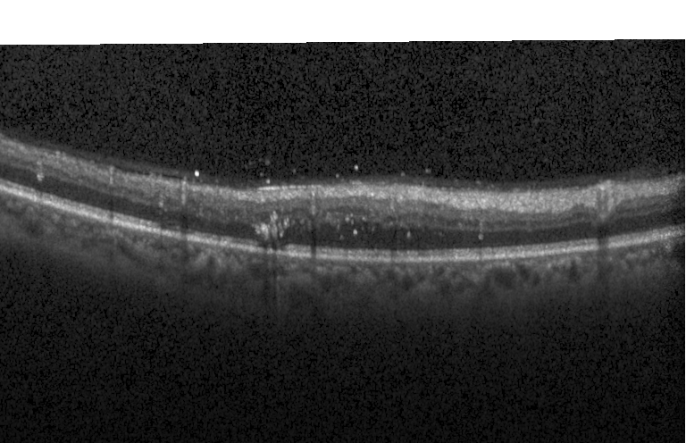

## Introduction




The code provides image reading from raw Spectralis(.vol) and Cirrus(.img) and Matlab files (.mat). It supports 
retina flatten, cropping, reconstruction and visualization e.t.c

We provide Matlab preprocessing steps and results in the papers:

**Fully Convolutional Boundary Regression for Retina OCT Segmentation** ([MICCAI2019](https://link.springer.com/chapter/10.1007/978-3-030-32239-7_14))

**Deep learning based topology guaranteed surface and MME segmentation of multiple sclerosis subjects from retinal OCT** ([BOE2019](https://www.osapublishing.org/boe/abstract.cfm?uri=boe-10-10-5042))

The paper's source code is patented and licensed thus will not be publicly available at current stage.


## Getting Started
### Prepare dataset

**Diabetic macular edema dataset** ([download](http://people.duke.edu/~sf59/Chiu_BOE_2014_dataset.htm))

**Healthy and Multiple Sclerosis dataset** ([download](http://iacl.ece.jhu.edu/index.php/Resources))

### Flattening retina and save images
#### Healthy and MS subjects
- Change  ```./hc/filename.txt```  and ```./hc/segname.txt``` to contain your downloaded data volumes and delineations

- Run ```./Scripts/generate_hc_train('./hc/filename.txt','./hc/segname.txt')```

#### DME

- Change  ```filenames``` in ```./Scripts/generate_dme_train.m``` to contain your downloaded data and run

Each Bscans will be saved into 2D images (.png) and its manual labels are in Json format (.txt).
```
# The python code for reading manual labels
# self.labellist = sorted(list(Path('Your label path').glob('*.txt')))
with open(str(self.labellist[idx]),'r') as f:
    dicts = json.loads(f.read())
bds = np.array(dicts['bds'], dtype=np.float) - 1 
mask = np.array(dicts['lesion'])
```
### MICCAI2019 results
- Download the [results](https://drive.google.com/open?id=10zEf5JJL4-ItropgQ1S9VBX4NFbMyvYa) and unzip it under the folder Evaluation 
- Healthy and MS evaluation: Run ```hc_eval.m```

  Training: hc09-hc14 and ms13-ms21 (6 healthy and 9 MS, hc09, ms13, ms14 can be used for validation) 
  Testing: hc01-hc08 and ms01-ms12 (8 healthy and 12 MS)
 - DME evaluation: Run ```dme_eval.m```
   
   Standard 50%-50% split are used as in the literature with a fixed training epoch.

